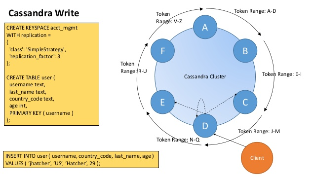
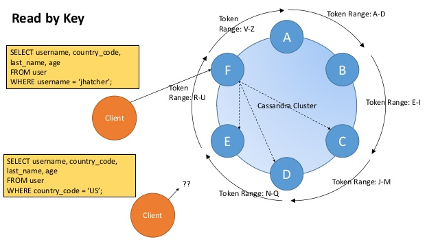
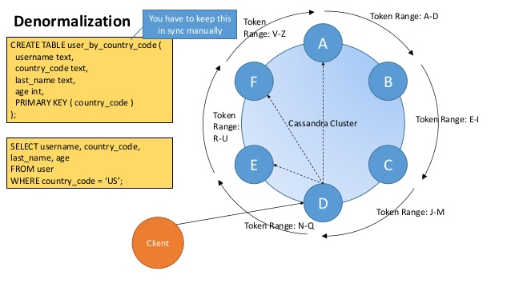
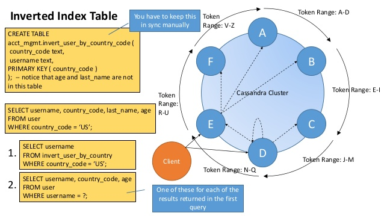
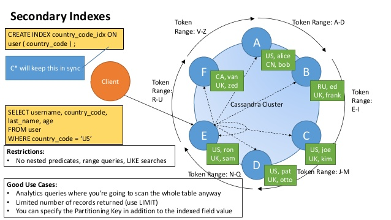
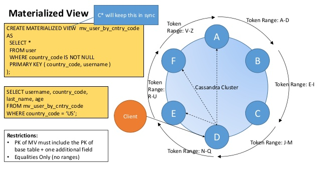
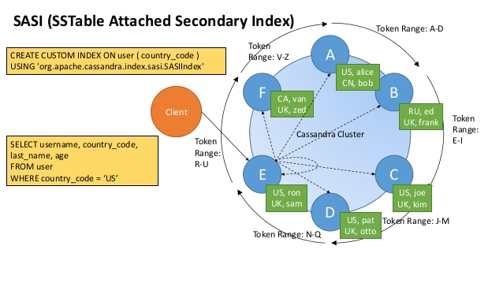
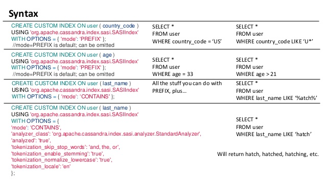

# C* Indexing

  
  
  
  
  
  
  
  

**References:**
- [cassandra indexes](https://pantheon.io/sites/default/files/Cassandra_main.png)
- [secondary index deep dive](https://www.datastax.com/dev/blog/cassandra-native-secondary-index-deep-dive)
